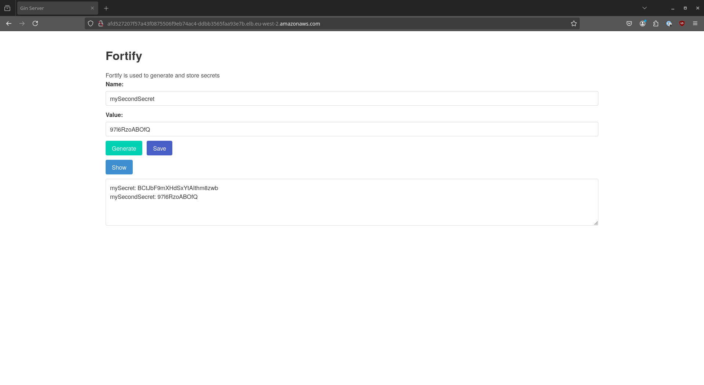

# Fortify
Fortify is a project created so I can explore new skills and tools with a focus on DevOps. This is a Monorepo so all code and configuration can be found in this repository

## About Fortify
Fortify is a key value store that consists of an api web application and a mysql database. Each component is dockertized and stored in a container Registry which is used to deploy into a kubernetes cluster.

## Overview
- [Applications (Go and Docker)](services/)
- [Continous Intergration (GitHub Actions)](actions/)
- [Infrastructure (AWS and Terraform. Kops for k8s infra)](infra/)
- [Deployment & Operations (Kubernetes)]()
- [Testing (WIP: Python Playwright and Locust)](fortify-testing/)
- [Documentation](docs/)

### Fortify Web Application

### Basic Diagram

## Fortify
Fortify a web application that serves as the main service in this project. It is written in Go and uses Gin to service a frontend UI to the user. Fortify is where the user can input their key name and value they want to store. It so interacts with other components of the project such as thedatabase and the generator API. All k/v pairs stored in Fortify can be retrived by the show button

## Generator 
Generator is a API running on Go and Gin. It's purpose is to generate random strings that can be used as the value field in Fortify. Fortify has a button that will request a string from Generator and use it in the value field on Fortify, this is done is the user needs to store a new random value like a secret or password.

## Continous Intergration
This project uses GitHub Actions to CI

### Quality check
Fortify is setup so when a change is made to the services(Generator or Fortify) and pushed it will trigger a action. This action is a quality assurance check to make sure the service is working as expected. This step will run the follow checks:
- Run unit tests
- Run the GolangCi-linter
- Run the build command

### Build Docker image
There is a action that can be triggered manually to build a docker container for the services. This job will take in the semantic version number to tag the build with and a optional environment configuration file. This Actions will get AWS credentials for a user with access to ECR and once the image is built from the dockerfile push the image to the registry.

## Infrastructure
There are multiple tools used to handle infratrcutre on this project.

### Terraform
Terraform does the majority of the work. Several modules have been created to make them resuable Current uses:
- Create a IAM user that has a policy setup so it only has access to ECR. this is used to push docker images from a GitHub Action.
- Create a S3 bucket for storing the Terraform backend so it's always available
- Create multiple ECR Repositories for storing images with a policy so limit the amount of images that can be stored. Image security scanning has also been configured

### Kops
Kops is used to provision and setup infra for a kubernetes cluster. Kops configuration files were generated and are used to setup the cluster. This is where changes are made to the overal cluster such as the amount of nodes and the availabllity zones. To simplify usage of kops all the commands used have been placed in a justfile.

## Deployment
The Fortify service's is manually deployed into the k8s cluster by running a bash script which will create the objects from the object spec files.

Objects created:
- ConfigMap for handling environment variables
- Secrets for sensitive data required by other objects
- Deployments used for running the main services with set replicas
- Services to allow traffic among the pods, static ip addresses are used for some applications
- StatefulSet used to create MySql database and a persistent volume claim to store db data in a persistence volume
- StorageClass for dynamically provisitioning the persistent volume for the MySql db
- Ingress to add loadbalancing and exposing the Fortify application to the end user
